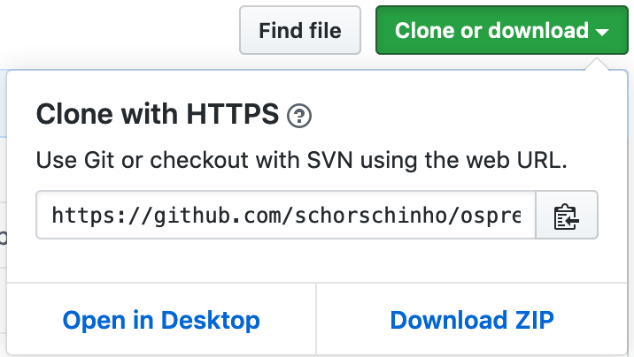
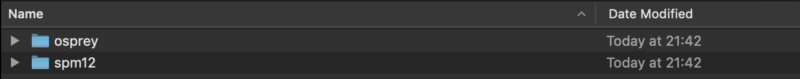

# Getting started

## System requirements

**Osprey** requires [MATLAB](https://www.mathworks.com/products/matlab.html) and
has been tested on version 2017a and newer (2019a and newer is required for the GUI). The following toolboxes are
required for full functionality:

  - Optimization
  - Statistics and Machine Learning

```{block2, note-license, type='rmdnote'}
You may need to ask your system administrator for a separate license for missing toolboxes.
```

You can check your current MATLAB version and the available toolboxes with the following command at the MATLAB prompt:

```octave
>> ver
```

```octave
-----------------------------------------------------------------------------------------------------
MATLAB Version: 9.4.0.949201 (R2018a) Update 6
MATLAB License Number: 703789
Operating System: Mac OS X  Version: 10.14.6 Build: 18G4032
Java Version: Java 1.8.0_144-b01 with Oracle Corporation Java HotSpot(TM) 64-Bit Server VM mixed mode
-----------------------------------------------------------------------------------------------------
MATLAB                                                Version 9.4         (R2018a)
Curve Fitting Toolbox                                 Version 3.5.7       (R2018a)
GUI Layout Toolbox                                    Version 2.3.4       (R2018b)
Global Optimization Toolbox                           Version 3.4.4       (R2018a)
Image Processing Toolbox                              Version 10.2        (R2018a)
Neural Network Toolbox                                Version 11.1        (R2018a)
Optimization Toolbox                                  Version 8.1         (R2018a)
Parallel Computing Toolbox                            Version 6.12        (R2018a)
Signal Processing Toolbox                             Version 8.0         (R2018a)
Statistics and Machine Learning Toolbox               Version 11.3        (R2018a)
Symbolic Math Toolbox                                 Version 8.1         (R2018a)
Wavelet Toolbox                                       Version 5.0         (R2018a)
Widgets Toolbox                                       Version 1.3.330     (R2019a)
```

```{block2, note-toolboxes, type='rmdnote'}
The available toolboxes (including SPM) are checked at the initial call of the Osprey GUI, and missing toolboxes are reported back to the user.
```

## Installing Osprey

Get the latest **Osprey** code from our [GitHub repository](https://github.com/schorschinho/osprey):

  - Clone the repository, or download and extract the contents of the .ZIP file to a directory on your drive.

    ```{r installOsprey, fig.cap='Cloning Osprey from GitHub.', echo=FALSE, message=FALSE, warning=FALSE}
    
    ``` 
    
  - Add the entire `osprey` directory (with subfolders) to your MATLAB path.
  - Make sure to regularly check the repository for updates, as we frequently commit new features, bug fixes, and improved functions.

To perform voxel co-registration and tissue segmentation, download **SPM12** [from the University College London website](http://www.fil.ion.ucl.ac.uk/spm/software/spm12/). You will need to provide the SPM team with some information before you can access the download link.

  - Extract the downloaded archive so that the `spm12` folder is on the same directory level as the `osprey` folder:
  
 ```{r spmFolder, fig.cap='Make sure that the SPM12 and Osprey folders are in the same directory.', echo=FALSE, message=FALSE, warning=FALSE}
    
 ``` 

  - Add the `spm12` folder to your MATLAB path, but **without** subfolders.
  
```{block2, noteSPMsub, type='rmdwarning'}
 - during testing, we have found that adding SPM subfolders to the MATLAB path can cause functions to fail. Add the top-level directory to your path, but not subfolders.
```

If you want to use the **Osprey** Graphical User Interface (GUI), please download the following toolboxes from the MATLAB File Exchange:

  - [GUI Layout Toolbox](https://www.mathworks.com/matlabcentral/fileexchange/47982-gui-layout-toolbox)
    (David Sampson)

  - [Widget Toolbox](https://www.mathworks.com/matlabcentral/fileexchange/66235-widgets-toolbox)
    (Robin Jackey)

Download both toolboxes in the MATLAB toolbox format (.mltbx). You can double-click to install. MATLAB will automatically add the toolboxes to its path.

## How to organize your raw data

Raw MRS data come in an overwhelming variety of formats, each producing
different numbers of files. **Osprey** does not make a lot of assumptions with regard to your folder structure, since you specify the exact location for each file in a job file prior to each analysis. It is **highly** recommended, however, that you store different acquisitions in separate folders. Organizing your raw data in a consistent and meaningful way will save you a lot of time and nerves.

To ensure optimal functioning of **Osprey**, we suggest adapting the folder
hierarchy [proposed by the BIDS (Brain Imaging Data Structure)
initiative](https://github.com/bids-standard/bids-starter-kit/wiki/The-BIDS-folder-hierarchy):

> There are four main levels of the folder hierarchy, these are:
```
project/
└── subject
    └── session
        └── acquisition
```
> With the exception of the top-level `project` folder, all sub-folders have a specific structure to their name (described below). Here's an example of how this hierarchy looks:
```
myProject/
└── sub-01
    └── ses-01
        └── anat
```

An example adaptation of this hierarchy for Philips MRS data could look like this:

```
myProject/
├── sub-01
│   └── ses-01
│       ├── anat
│       │   └── sub-01_T1w.nii
│       └── mrs
│           ├── sub-01_mega-press_act
│           │   ├── sub-01_mega-press_act.sdat
│           │   └── sub-01_mega-press_act.spar
│           ├── sub-01_mega-press_ref
│           │   ├── sub-01_mega-press_ref.sdat
│           │   └── sub-01_mega-press_ref.spar
│           └── sub-01_press-water
│               ├── sub-01_press-water_act.sdat
│               └── sub-01_press-water_act.spar
├── sub-02
│   └── ses-01
│       ├── anat
│       │   └── sub-02_T1w.nii
│       └── mrs
│           ├── sub-02_mega-press_act
│           │   ├── sub-02_mega-press_act.sdat
│           │   └── sub-02_mega-press_act.spar
│           ├── sub-02_mega-press_ref
│           │   ├── sub-02_mega-press_ref.sdat
│           │   └── sub-02_mega-press_ref.spar
│           └── sub-02_press-water
│               ├── sub-02_press-water_act.sdat
│               └── sub-02_press-water_act.spar
...
...
```

While adhering to the BIDS standard is strongly recommended, it is by no means
binding for most file formats. You can, for example, keep Siemens TWIX files
(`.dat`) all in the same folder, and **Osprey** will be able to handle them, if
you define their paths in the job file accordingly.

```{block2, noteBIDSRDA, type='rmdwarning'}
There is one exception: For data stored in single-average DICOM (`*.IMA`, `*.DCM`) or single-average Siemens RDA format, it is **absolutely necessary** to keep every scan in a separate folder.
```
