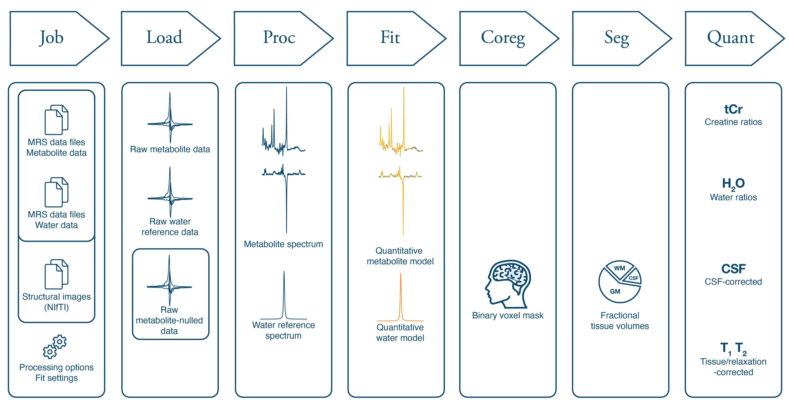

# The Osprey Workflow

**Osprey** was designed to have an easy, linear workflow with as little user input as possible. It has many built-in routines to recognize data formats and sequence types, and will be able to perform most required processing steps automatically.

Osprey consists of seven separate modules –  Job, Load, Proc, Fit, Coreg, Seg, and Quant, all of which are sequentially called in a graphical user interface. Alternatively, users can conduct the entire workflow from the MATLAB command prompt.

```{r workflowChart, fig.cap='The Osprey workflow.', echo=FALSE, message=FALSE, warning=FALSE}

```

Some input will need to be provided by the user in the form of a *job*.
A job specifies the locations of the files containing MRS and structural imaging
data, the type of MRS sequence, and some basic control options over the data
modeling procedure.

While a job is progressing through the **Osprey** pipeline, all raw and processed data associated with this job are stored in a MATLAB structure, the Osprey *data container*. By default, this container is called `MRSCont`, but you are free to give it a more meaningful variable name.

**Osprey**'s data handling is largely based on the [free MATLAB toolbox FID-A](https://github.com/CIC-methods/FID-A). The **Osprey** folder contains a library of, sometimes modified, FID-A functions and additions. Please make sure that you do **not** include an installation of the original FID-A suite in your MATLAB path, as some functions in the **Osprey** folder might be shadowed by FID-A functions with the same name.

The `MRSCont` data container functions as a super-structure, containing
FID-A structures for each dataset and processing step, along with additional
information, e.g. quality metrics, quantification results, etc.
