# Osprey GUI tutorial

This tutorial describes each step of the **Osprey** analysis workflow using the graphical user interface.

We will learn how to start the GUI, select the job file, load the raw data, process them into spectra, model the processed spectra, co-register the voxel to anatomical images, segment the anatomical images, and derive quantitative metabolite estimates.

```{block2, noteTutorialFolder, type='rmdnote'}
In this documentation chapter, we will use the `jobTwix.m` job file in the `exampledata/twix/` directory of the [**Osprey** repository](https://github.com/schorschinho/osprey).
```

## Starting Osprey

At the MATLAB prompt, enter

```octave
>> Osprey
```

This will initiate the **Osprey** GUI application and the underlying processing modules. Once the startup is complete, you will see the **Osprey** startup menu box:

```{r ospreyStartupMenu, fig.cap='The Osprey Startup Menu.', echo=FALSE, message=FALSE, warning=FALSE}
knitr::include_graphics("img/04-osprey-startup-menu.png")
```

## Loading a job file

Click the `Load Job file` button, navigate to the `exampledata/twix` directory, and add the file `jobTwix.m` to the right column:

```{r ospreySelectJobFile, fig.cap='Selecting a job file.', echo=FALSE, message=FALSE, warning=FALSE}
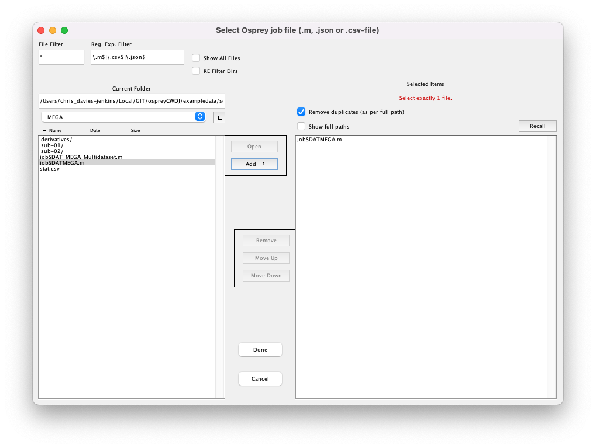
```

Click `Done`. If you have run an **Osprey** analysis previously with the same output folder specified in the job file, you will be shown a warning:

```{r ospreyOverwriteWarning, fig.cap='Warning when you are about to overwrite a previous analysis.', echo=FALSE, message=FALSE, warning=FALSE}
knitr::include_graphics("img/04-warning-overwrite.png")
```

Click `Yes`. **Osprey** will now extract all necessary information from the job file you selected by running the `OspreyJob` module in the background. The next window you see is the main GUI:

```{r ospreyJob, fig.cap='The Osprey GUI after OspreyJob.', echo=FALSE, message=FALSE, warning=FALSE}
knitr::include_graphics("img/04-osprey-gui-job.png")
```

In the bottom left corner, you see a list of datasets included in the job file definition.

```{block2, noteTabsButtons, type='rmdnote'}
All tabs and buttons (except `Load Data`, `Save MRSCont`, and `Exit`) are greyed out at this stage. They will become gradually available as we progress through the analysis workflow.
```

## Loading the raw MRS data

Click the `Load data` button to initiate the loading process of the raw MRS data. **Osprey** will now extract the raw FIDs and header data (and perform coil combination, if applicable) by running the `OspreyLoad` module in the background. For larger files (with separate FIDs for each coil), this process may take a few seconds per dataset. You can monitor the progress through the wait bar.

Once the loading process is complete, you can see the coil-combined, but un-aligned and un-averaged data. You can select the dataset you wish to be displayed by clicking on the entry in the dataset list in the bottom left corner, and you can easily scroll through the different datasets using the <kbd>⬆</kbd> and <kbd>⬇</kbd> keys on your keyboard.

<table>
  <tr>
    <th style="text-align:center">First dataset</th>
    <th style="text-align:center">Second dataset</th>
  </tr>
  <tr>
    <td halign="center">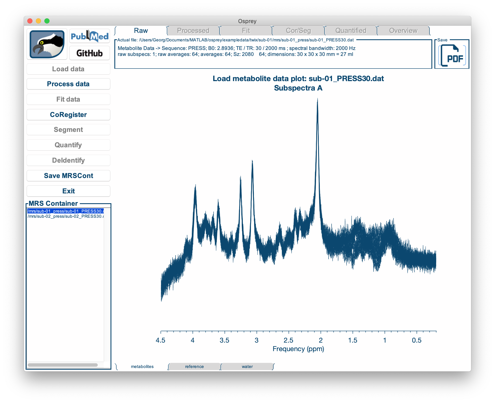</td>
    <td halign="center">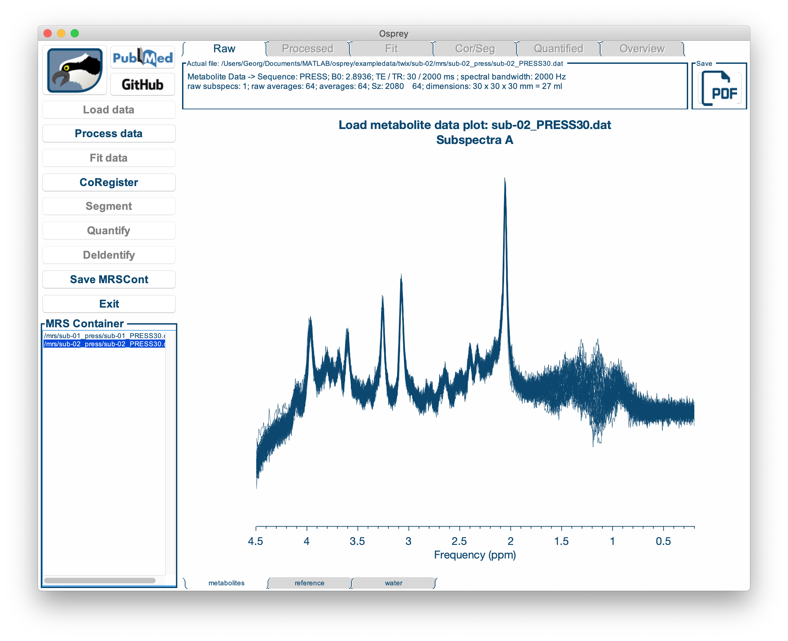</td>
  </tr>
</table>

By clicking the `metabolites`, `reference` and `water` tabs at the bottom of the window, you can display the water-suppressed, lineshape reference, and short-TE water data (if applicable):

<table>
   <tr>
     <th style="text-align:center">Metabolite data</th>
     <th style="text-align:center">Lineshape reference data</th>
     <th style="text-align:center">Short-TE water data</th>
   </tr>
   <tr>
     <td halign="center"></td>
     <td halign="center">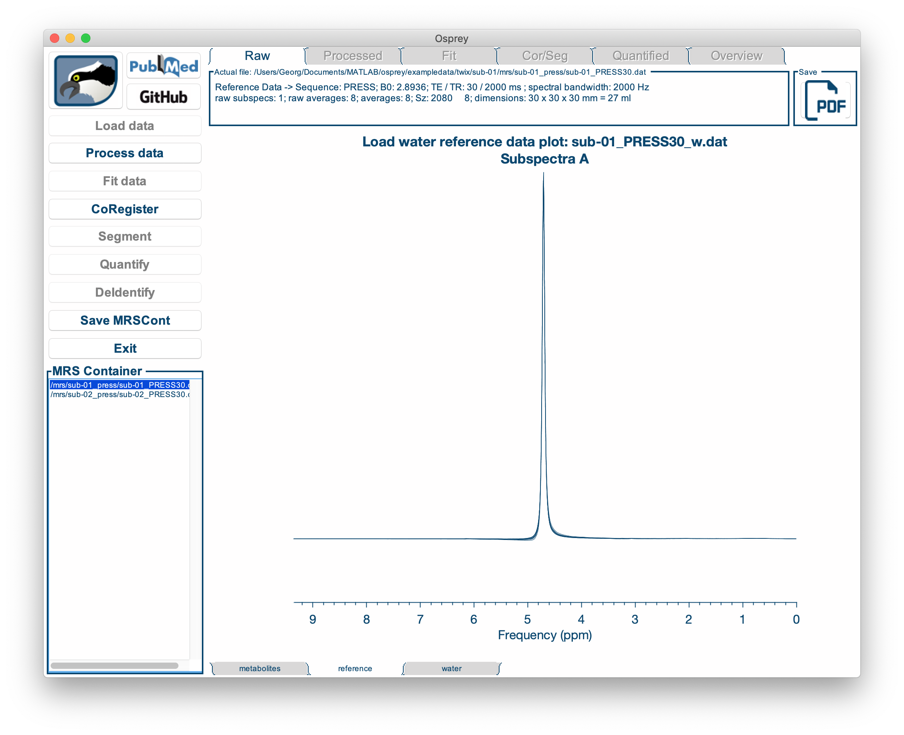</td>
     <td halign="center"></td>
   </tr>
</table>

```{block2, noteSequenceInfoBox, type='rmdnote'}
In the box above the spectrum display, you will find useful information about the sequence, such as TR/TE, number of averages, voxel dimensions, etc.
```

```{block2, noteExportPDFRaw, type='rmdnote'}
You can export a PDF of the spectrum (along with the information box) by clicking on the `Save PDF` button in the top right corner of the window.
```

## Processing the raw data

Click the (now available!) `Process data` button to initiate the post-processing. **Osprey** will now perform all appropriate processing steps (depending on the available data: eddy-current correction, frequency-and-phase alignment, water removal, frequency referencing, initial phasing) by running the `OspreyProcess` module in the background. This process may take several seconds per dataset. You can monitor the progress through the wait bar.

Once the post-processing is complete, the `Processed` tab becomes active, showing four different panels:

```{r ospreyProcess, fig.cap='The Osprey GUI after OspreyProcess.', echo=FALSE, message=FALSE, warning=FALSE}
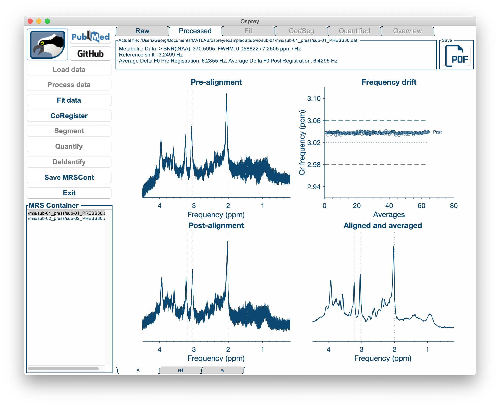
```

The top left panel shows the individual averages prior to frequency-and-phase alignment. The bottom left panel shows them after frequency-and-phase alignment.
The top right panel shows a scatter plot of the maximum of the 3.02 ppm Cr/PCr signal over the course of the acquisition for both pre- and post-alignment. Finally, the bottom right panel shows the aligned, averaged and referenced spectrum after eddy-current correction and residual water removal. This spectrum will be passed on to the `Fit` module for modeling.

```{r ospreyProcess2, fig.cap='Different sub-spectra can be visualized by cycling through the "Spec" windows.', echo=FALSE, message=FALSE, warning=FALSE}
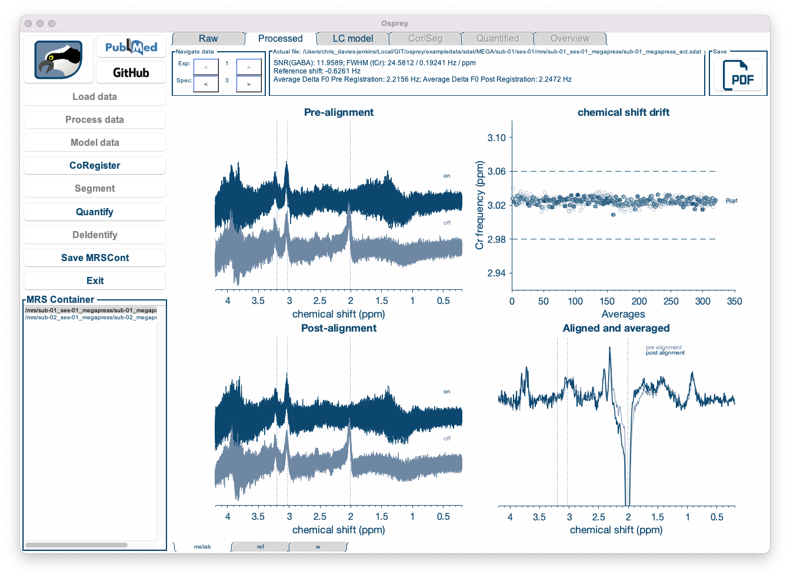
```

Individual sub-spectra, and combinations thereof, can be visualized by cycling through the "spec" arrows at the top left of the screen.

```{block2, noteGoBackRaw, type='rmdnote'}
You can go back to inspecting the raw data by clicking the `Raw` tab at the top of the window.
```

Again, you can display each dataset by selecting it from the dataset list in the bottom left corner, and you can look at the water reference data by clicking on the tabs at the bottom of the window.

```{block2, noteQABox, type='rmdnote'}
In the box above the spectrum display, you will find some data quality metrics, such as the signal-to-noise ratio (SNR), linewidth (FWHM), and average frequency drift pre- and post-alignment.
```

```{block2, noteExportPDFProcessed, type='rmdnote'}
You can export a PDF of the four post-processing display panels (along with the information box) by clicking on the `Save PDF` button in the top right corner of the window.
```

## Fitting the spectra

Click the (now available!) `Fit data` button to initiate the post-processing. **Osprey** will now model the processed metabolite and water spectra by running the `OspreyFit` module in the background. This process may take a few seconds, or up to a minute or more per dataset, depending on the complexity of the data and model. You can monitor the progress through the wait bar.

Once the modeling is complete, the `Fit` tab becomes active:

```{r ospreyFit, fig.cap='The Osprey GUI after OspreyFit.', echo=FALSE, message=FALSE, warning=FALSE}
knitr::include_graphics("img/04-fit-mets.png")
```

The `Fit` tab displays the complete fit overlaid on top of the data, along with the smooth cubic B-spline baseline, and the fit residual at the top.
Below, the contributions from each basis functions are plotted, with the estimated lineshape convolution, linebroadening and frequency shift parameters applied. For better display, the phase parameters have been applied to the spectrum, so that the basis functions appear without phase.
The left panel shows the raw water-scaled metabolite estimates, i.e. the signal amplitudes normalized by the water amplitude. The amplitude parameters will subsequently be used during the quantification process to derive tCr ratios and water-scaled estimates.

```{block2, noteGoBackToProcessed, type='rmdnote'}
You can go back to the previous analysis steps by clicking the `Raw` or `Processed` tabs at the top of the window.
```

Again, you can display each dataset by selecting it from the dataset list in the bottom left corner, and you can look at the water reference data fits by clicking on the tabs at the bottom of the window.

```{block2, noteFitInfoBox, type='rmdnote'}
In the box above the spectrum display, you will find fit parameters and information, such as the number of basis functions used, phase estimates, and scaling factors.
```

```{block2, noteExportPDFFit, type='rmdnote'}
You can export a PDF of the fit (along with the information box) by clicking on the `Save PDF` button in the top right corner of the window.
```

## Co-registering to an anatomical image

Click the `CoRegister` button to initiate the SPM routines for co-registering a voxel to a T1-weighted anatomical image. **Osprey** will now parse the voxel geometry information and create the voxel mask by running the `OspreyCoReg` module in the background. This process will take a few seconds per dataset. You can monitor the progress through the wait bar.

```{block2, noteSkipProcessFitCoreg, type='rmdnote'}
If you are only interested in the voxel mask, you can skip the `Process` and `Fit` steps of the analysis. The `CoRegister` button becomes available after the `Load data` analysis step has been completed.
```

Once the co-registration is complete, the `Cor/Seg` tab becomes active:

```{r ospreyCoreg, fig.cap='The Osprey GUI after OspreyCoReg.', echo=FALSE, message=FALSE, warning=FALSE}
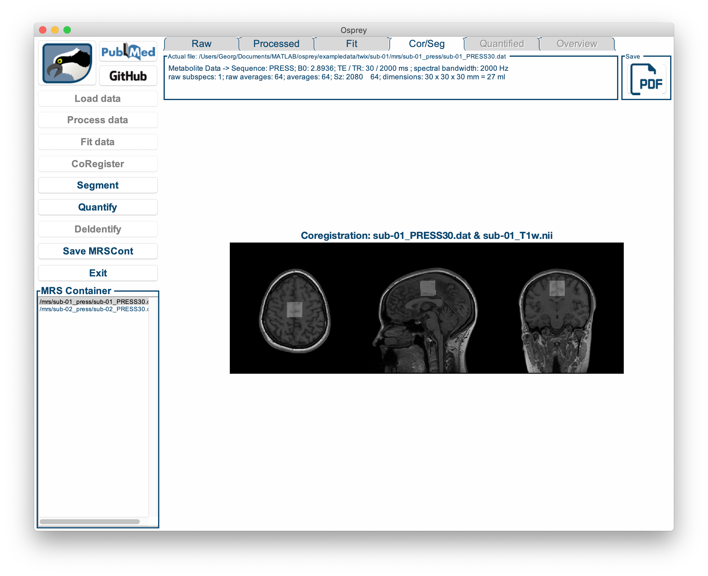
```

You can see an overlay of the voxel mask on top of the anatomical image in three directions.

```{block2, noteExportPDFCoreg, type='rmdnote'}
You can export a PDF of the co-registration display by clicking on the `Save PDF` button in the top right corner of the window.
```

```{block2, noteNiiView, type='rmdnote'}
The `Nii Viewer` button in the top left corner of the window opens the current paricipant's structural image in an external NIfTI viewer for closer inspection.
```

## Segmentation and tissue fraction calculation

Click the `Segment` button to initiate the determination of the tissue volume fractions for the co-registered voxel. **Osprey** will now call the SPM12 segmentation functions and calculate the fractions of grey matter, white matter, and cerebrospinal fluid by running the `OspreySeg` module in the background. If you have previously segmented the images, this step will only take a few seconds. However, if **Osprey** has to initiate the segmentation first, it can take up to several minutes per dataset. You can monitor the progress through the wait bar.

```{block2, noteSkipProcessFitSeg, type='rmdnote'}
If you are only interested in the tissue fractions, you can skip the `Process` and `Fit` steps of the analysis. The `Segment` button becomes available after the `Load data` and `CoRegister` analysis steps have been completed.
```

Once the segmentation is complete, the `Cor/Seg` tab features another figure:

```{r ospreySeg, fig.cap='The Osprey GUI after OspreySeg.', echo=FALSE, message=FALSE, warning=FALSE}
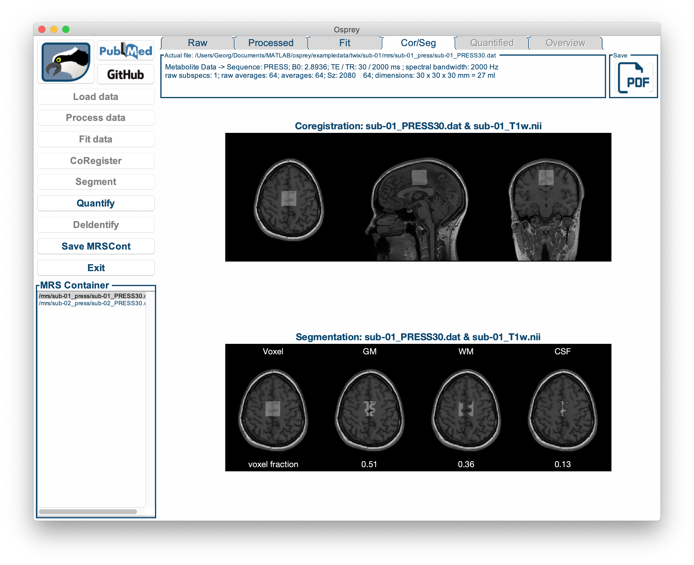
```

Below the overlay produced by `CoRegister`, you can now see four images showing the voxel mask next to the contributions from grey matter, white matter, and CSF, along with the fractional volume estimates for each tissue class. These values will subsequently be used during quantification to account for tissue-specific effects of relaxation, tissue water content, and metabolite content.

```{block2, noteExportPDFCoregSeg, type='rmdnote'}
You can export a PDF of the combined co-registration/segmentation display by clicking on the `Save PDF` button in the top right corner of the window.
```

## Quantification

Click the `Quantify` button to have **Osprey** run the `OspreyQuantify` module in the background. This should take less than a second per dataset. During this process, several quantitative metabolite estimates are calculated, such as tCr ratios and water-scaled estimates with different degrees of sophistication. Please refer to the **Osprey** manuscript for details on the implementation of these quantification routines.

Once the quantification is complete, the `Quantify` tab becomes active:

```{r ospreyQuantify, fig.cap='The Osprey GUI after OspreyQuantify.', echo=FALSE, message=FALSE, warning=FALSE}
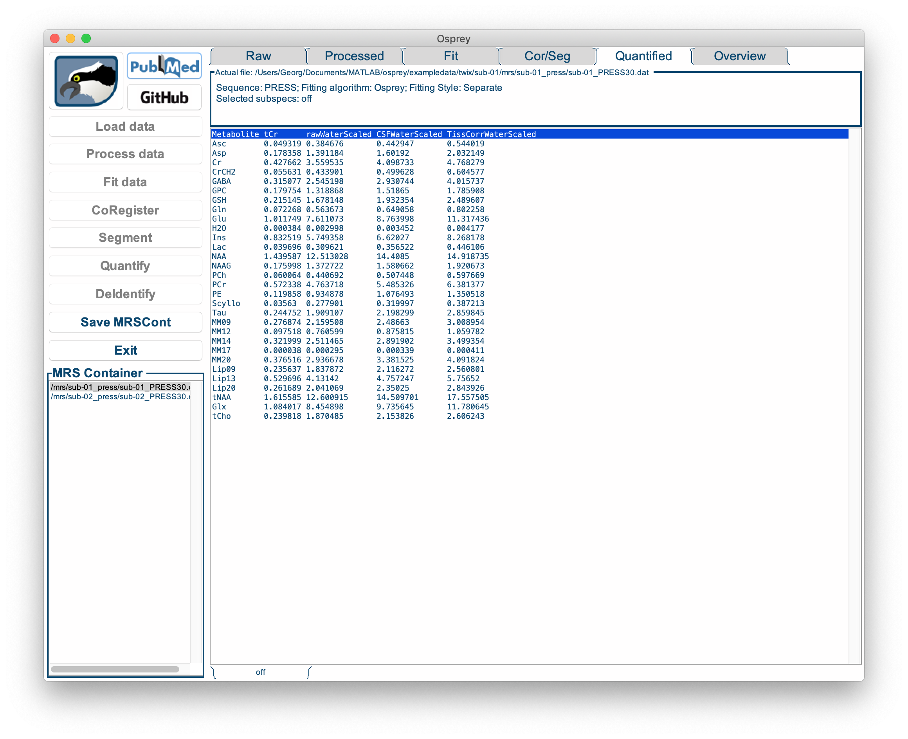
```

This tab contains a bare-bone table of the quantitative results for each basis function and each quantification routine for the selected dataset. These numbers are saved in `.CSV` format tables in the `QuantifyResults` sub-directory of the output folder.

At this stage, all analysis steps have been completed. You can save the current state of the analysis by exporting it the **Osprey** data container as a `.mat` file using the `Save MRSCont` button. You can re-load it at any time using the `Load MRSCont file` button in the Osprey startup menu (see Step 1 of this tutorial).

## Overview

After quantification is complete, another tab becomes active: `Overview`. This tab contains several visualizations that are interesting for the batched analysis of multiple datasets.

By clicking on the tabs at the bottom of the window, you can cycle through the following visualizations:

- **Spectra**: Displays all processed spectra (or fits) on top of each other in a single plot.

```{block2, noteDropdownOverviewDataFits, type='rmdnote'}
You can select the data or complete fits for the metabolite and water data by using the dropdown menu at the top of the window.
```

```{r ospreyOverviewSpectra, fig.cap='The Overview Spectra tab in the Osprey GUI.', echo=FALSE, message=FALSE, warning=FALSE}
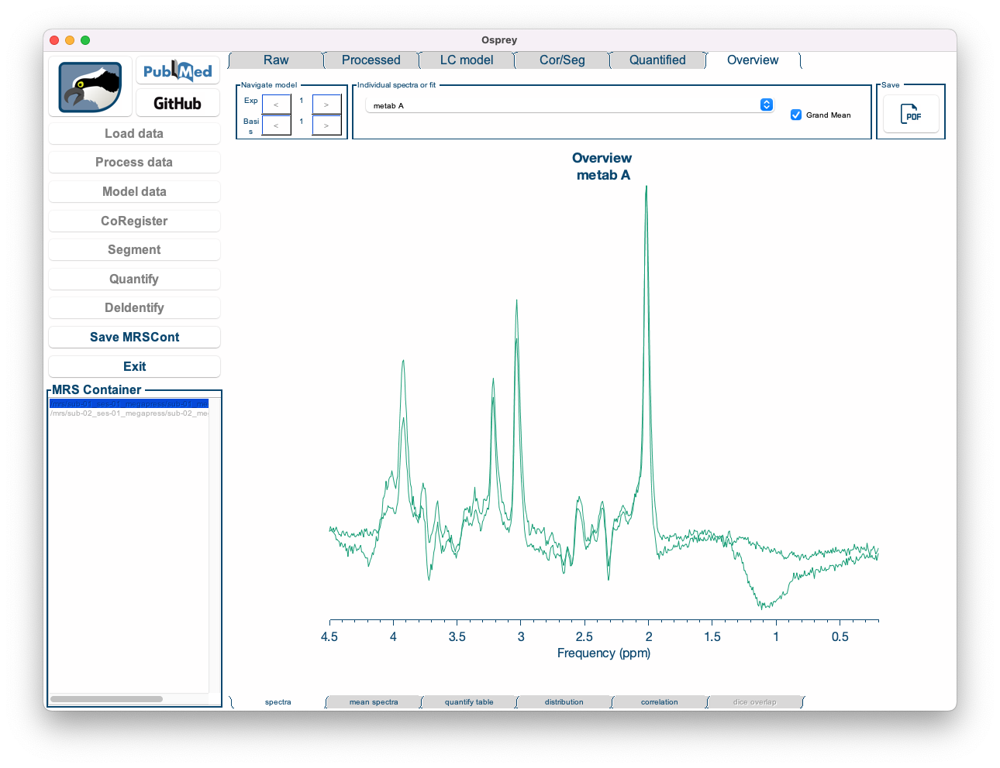
```

- **Mean spectra**: Displays the mean of spectra (or fits) across all datasets, along with the mean baseline, mean residual, and a ribbon plot representing the standard deviation across all spectra.

```{block2, noteDropdownOverviewMetsWater, type='rmdnote'}
You can select the metabolite and water data by using the dropdown menu at the top of the window.
```

```{r ospreyOverviewMeanSpectra, fig.cap='The Overview Mean Spectra tab in the Osprey GUI.', echo=FALSE, message=FALSE, warning=FALSE}
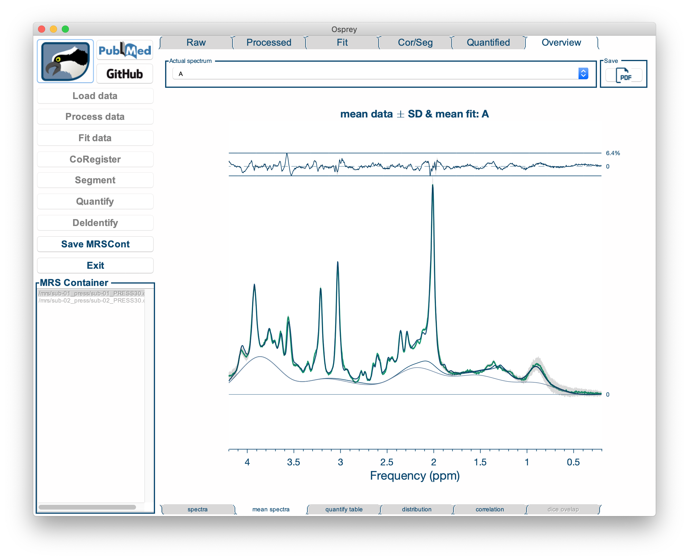
```

- **Mean spectra**: Displays the mean of spectra (or fits) across all datasets, along with the mean baseline, mean residual, and a ribbon plot representing the standard deviation across all spectra.

```{block2, noteTDropdownOverviewMeanMetsWater, type='rmdnote'}
You can select the metabolite and water data by using the dropdown menu at the top of the window.
```

- **Quantify table**: Shows a table with the results of a specific quantification routine for all metabolites and all datasets.

```{block2, noteDropdownOverviewQuantifyReference, type='rmdnote'}
You can select the quantification routine to be displayed (tCr ratios, raw water-scaled, CSF-corrected water-scaled, tissue-corrected water-scaled) by using the dropdown menu at the top of the window.
```

```{r ospreyQuantifyTable, fig.cap='The Overview Quantify Table tab in the Osprey GUI.', echo=FALSE, message=FALSE, warning=FALSE}
knitr::include_graphics("img/04-overview-quantify-table.png")
```

- **Distribution**: Shows a raincloud plot of the results of a specific quantification routine for a specific metabolite. The raincloud plot includes a visualization of the distribution, the mean and median values of the distribution, standard deviation, and 25% and 75% percentiles. In addition, each data point is shown.

```{block2, noteDropdownOverviewDistributionQuantifyReference, type='rmdnote'}
You can select the quantification routine to be displayed (tCr ratios, raw water-scaled, CSF-corrected water-scaled, tissue-corrected water-scaled), as well as the particular metabolite you want to study.
```

By default, the `Distribution` tab is set to display the tCr ratios of tNAA.

```{r ospreyOverviewDistribution, fig.cap='The Overview Distribution tab in the Osprey GUI.', echo=FALSE, message=FALSE, warning=FALSE}
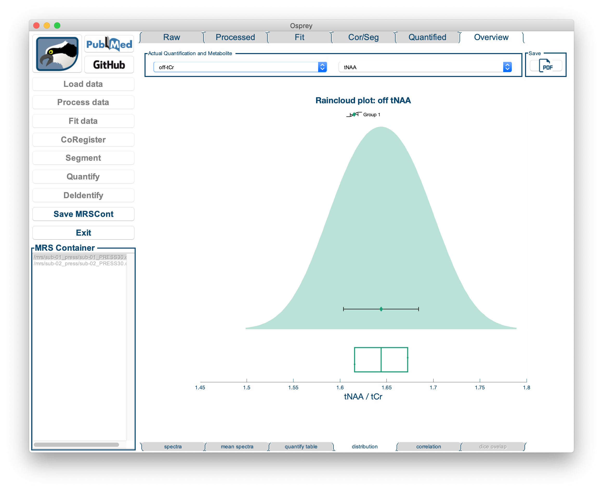
```

- **Correlation**: Shows a highly customizable 2D scatter plot of a quantitative metabolite estimate against another quantitative metabolite estimate, or a quality metric. **Osprey** automatically calculates the Pearson correlation coefficient and a p-value (uncorrected for multiple comparisons), and plots the linear regression line with shaded confidence intervals.

```{block2, noteDropdownCorrelation, type='rmdnote'}
You can select the quantification routine and metabolite to be correlated, as well as another metabolite or quality metric that it is to be correlated against, by using the dropdown menus at the top of the window.
```

By default, the `Correlation` tab is set to display the correlation of tNAA/tCr to SNR.

```{r ospreyOverviewCorrelation, fig.cap='The Overview Correlation tab in the Osprey GUI.', echo=FALSE, message=FALSE, warning=FALSE}
knitr::include_graphics("img/04-overview-correlation.png")
```

```{block2, noteAckRaincloud, type='rmdnote'}
We are incredibly grateful for the fantastic [raincloud plot tools](https://github.com/RainCloudPlots/RainCloudPlots) developed by Micah Allen, Davide Poggiali, Kirstie Whitaker, Tom Rhys Marshall, and Rogier Kievit. Should you make use of the OspreyOverview raincloud plots, please consider citing their original publications:

    >    * Allen M, Poggiali D, Whitaker K et al. Raincloud plots: a multi-platform tool for robust data
    > visualization [version 1; peer review: 2 approved].
    > Wellcome Open Res 2019, 4:63. DOI: 10.12688/wellcomeopenres.15191.1
    >    * Allen M, Poggiali D, Whitaker K, Marshall TR, Kievit R. (2018) RainCloudPlots tutorials and codebase (Version v1.1). Zenodo. http://doi.org/10.5281/zenodo.3368186

```
